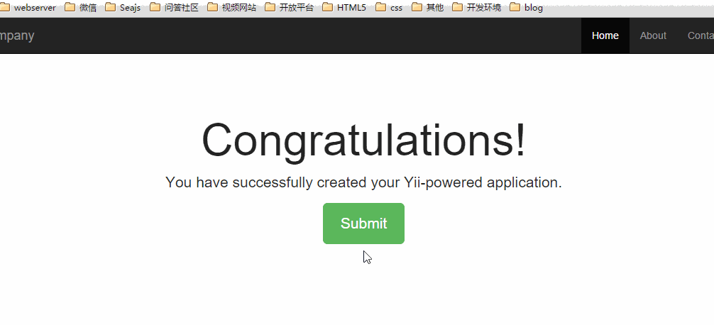

yii2-sweet-submit
-----------
[](https://packagist.org/packages/light/yii2-sweet-submit)
[](https://packagist.org/packages/light/yii2-sweet-submit)
[](https://github.com/lichunqiang/yii2-sweet-submit/issues)

By default `yii.js` using browser's `confirm` function to show confirm message.This library used `sweet-alert` to instead it:




## Install

```
$ composer require light\yii2-sweet-submit=*
```

## Usage

Can can depends this in your assets:

```
class YourAsset extends AssetBundle
{
    //..

    public $depends = [
        //your other depends
        'light\widgets\SweetSubmitAsset'
    ];
}
```

Or directly inject in the view:

```
use light\widgets\SweetSubmitAsset;

SweetSubmitAsset::register($this);
```

Once you had depends it in your project, `yii.swal` is available. What's this? It's just the [sweet-alert](http://t4t5.github.io/sweetalert/), now you can use it:

```
//your some.js
yii.swal('Opps. this is shown by sweet-alert');
```

There is more usage you can find from [document](http://t4t5.github.io/sweetalert/)

## License

